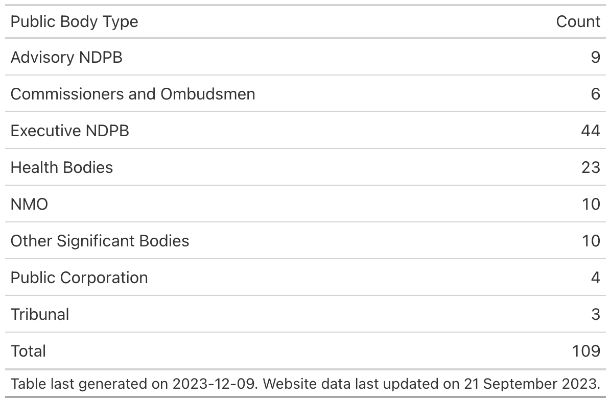

# scottish-pb-webscrape

Following a conversation at work, I wanted to learn the very basics of webscraping. To keep it fairly relevant, here I attempt to scrape the names of public bodies from the Scottish Government Public Body directory.

Currently, the script just gets the names, and even then, it isn't quite working. I think this is because the subpages with the different types of PBs have slightly different HTML structures, so I need to fine tune it.

The table below summarises the **current** total number of public bodies scraped by their type.

